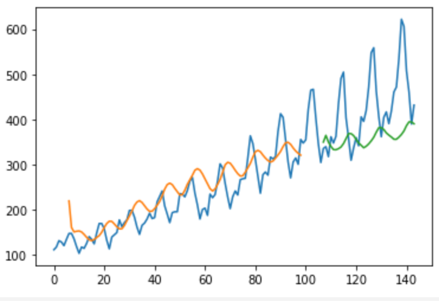

# LSTM basic model for time series

### Sample data: /data/airline-passengers.csv

### Prediction

#### Reference:
* https://machinelearningmastery.com/time-series-prediction-lstm-recurrent-neural-networks-python-keras/

### Some helpful python commands
* `pipreqs --print --force .  | sort > requirements.txt`  --to list used python packages in ascending order